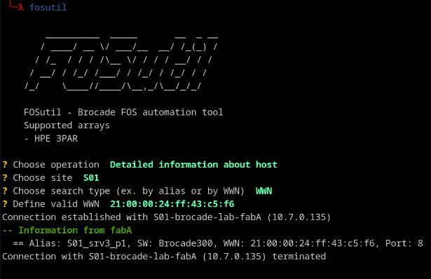
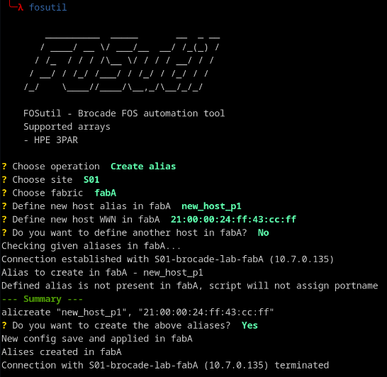
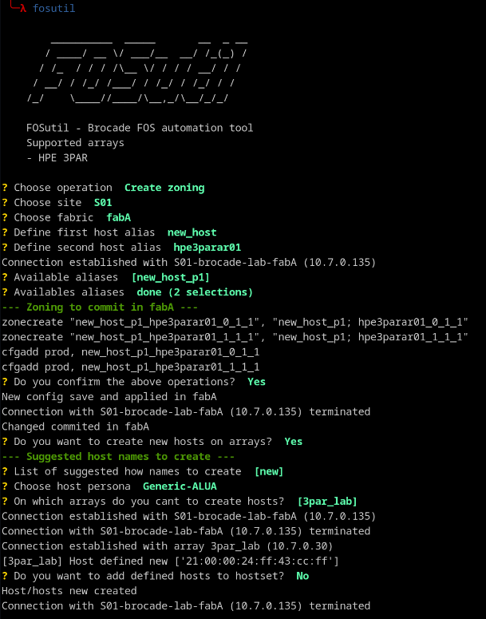

# FOSutil - Brocade FOS Automation Tool

FOSutil is an interactive Python CLI tool for automating Brocade SAN switch operations and limited HPE 3PAR storage array management.

## Requirements

- Python 3.7+
- See `requirements.txt` for dependencies

## Configuration

Configuration is loaded from a `.env` YAML file containing:

- `san_switches`: Switch credentials (host, username, password)
- `arrays`: HPE 3PAR array configurations

## Supported Operations

### Zoning Management
- **Check active zoning configuration** - View existing zones for a host alias
- **Create zoning** - Create zone pairs between host aliases
- **Remove zoning** - Delete existing zones

### Alias Management
- **Detailed information about host** - Lookup host by alias or WWN
- **Create alias** - Create new alias with WWN assignments
- **Remove alias** - Delete existing aliases

### HPE 3PAR Integration
- **Create hosts** - Define hosts on HPE 3PAR arrays with persona (Generic-ALUA, VMWare, WindowsServer)
- **Hostset management** - Add hosts to existing hostsets
- **Remove hosts** - Delete host definitions from arrays

## Usage

```bash
python main.py
```

The tool presents an interactive menu:
1. Select site
2. Select fabric (fabA, fabB, or both)
3. Choose operation
4. Confirm changes before each commit

The tool assumes that you have at least 2 fabrics for redundancy purposes.

Before using the tool you need to add entries to both Brocade switches and 3PAR arrays in .env file (see: `.env.example`) as well as:

- setting up you fabric names
- setting Brocade devices that are being used to connect to your fabrics (switches defined there are being used as entrypoints to commit changes to fabric configuration)
- customize regex expressions to match you naming convention


## Architecture

- `fosutil/cli/` - Interactive CLI menu and operations
- `fosutil/devices/` - Brocade switch connectivity (Netmiko)
- `fosutil/devices/hpe3par.py` - HPE 3PAR REST API client
- `fosutil/models/` - Data models (AliasObject, ZoneObject)
- `fosutil/config/` - Configuration and secrets loading
- `fosutil/utils/` - Utility functions (WWN validation, normalization)

## Screenshots

Finding detailed information about host port based on it's WWN



Creating host alias



Creating zoning between host and HPE 3PAR array + defining host on the array

